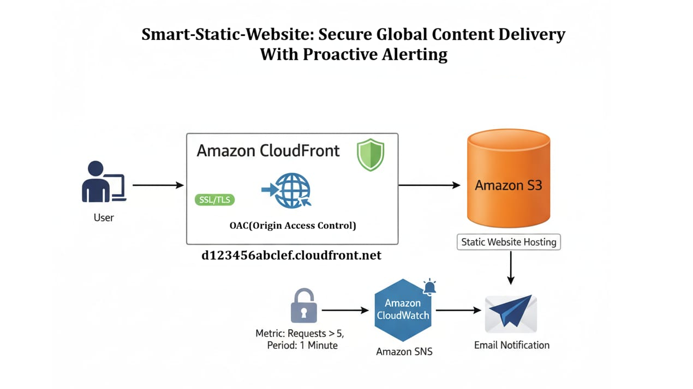

# 🌐 Smart-Static Website: Secure Global Content Delivery With Proactive Alerting

## 📋 Project Overview
This project focuses on hosting a highly available, secure, and globally accessible static website using Amazon S3 and Amazon CloudFront. The objective was to understand how modern websites are delivered at scale using AWS managed services, while ensuring high performance, low latency, and secure access without managing servers. Additionally, proactive alerting mechanisms were integrated to monitor performance and security.

## 🎥 Project Demonstration
Watch the full implementation and global CDN delivery here:  
**[▶️ Watch Project Video on My Portfolio](https://waves.in/project04.html)** 

**Project Context:** High-Performance Global Content Delivery  
**Timeline:** 3 Weeks (Edge Delivery & Security)  
**Environment:** Serverless Content Delivery Network (CDN)  
**Core Tech Stack:** Amazon S3, Amazon CloudFront, CloudWatch, SNS, IAM Policies, Origin Access Control (OAC)  

## 🎯 Objectives
- Host a static website using Amazon S3.
- Enable global content delivery using CloudFront CDN.
- Improve website performance and availability.
- Secure content delivery using CloudFront and OAC.
- Eliminate server management by utilizing serverless services.
- Implement proactive monitoring and alerting.

## 🌍 Environment Details
- ☁️ **Cloud Provider:** AWS
- ☁️ **Region:** ap-south-1 (Mumbai)
- ☁️ **Service Scope:** Global (via CloudFront Edge Locations)

## 🏗️ Architecture Diagram

## 🧱 Architecture Components
- 🏗️ **Amazon S3 Bucket:**
  - Stores static website files (HTML, CSS, JS, images)
  - Configured for static website hosting
- 🏗️ **Amazon CloudFront:**
  - Acts as a Content Delivery Network (CDN)
  - Distributes content through global edge locations
- 🏗️ **Origin Access Control (OAC):**
  - Prevents direct public access to the S3 bucket
- 🏗️ **IAM & Bucket Policies:**
  - Allows CloudFront to securely access S3 content
- 🏗️ **CloudWatch & SNS:**
  - Proactive monitoring of CDN metrics
  - Automated alerting for traffic spikes or errors
- 🏗️ **Users / Clients:**
  - Access website securely via CloudFront distribution URL

## 🔁 Traffic Flow
* **Inbound Traffic:** Users request the website through a browser.
* **Edge Routing:** Request reaches the nearest CloudFront edge location.
* **Cache Check:** If content is cached, CloudFront serves it immediately with low latency.
* **Origin Fetch:** If not cached, CloudFront securely fetches content from the S3 origin.
* **Delivery:** Content is delivered securely back to users.

## 🔐 Security & Best Practices Implemented
- 🛡️ S3 bucket is strictly not publicly accessible.
- 🛡️ Content served exclusively through CloudFront.
- 🛡️ Origin Access Control (OAC) used for secure access.
- 🛡️ HTTPS enabled via CloudFront for data encryption in transit.
- 🛡️ Serverless architecture significantly reduces the attack surface.

## 🧪 Validation & Testing
- [x] Verified website accessibility via CloudFront URL.
- [x] Confirmed S3 bucket is not directly accessible (Access Denied).
- [x] Tested caching behavior and cache invalidation from CloudFront.
- [x] Checked low-latency access from different geographical locations.
- [x] Validated CloudWatch metrics and SNS alerts.

## 💡 Key Learnings & Why This Project Matters
Through this project, I learned how to host and deliver static websites using fully managed AWS services without maintaining servers. I gained hands-on experience with Amazon S3 static website hosting, CloudFront CDN configuration, and secure content delivery using Origin Access Control. 

The project helped me understand how global content distribution improves performance, availability, and security while reducing operational complexity and cost. It demonstrates the ability to design scalable, cost-effective, and serverless web hosting solutions using AWS native services, reflecting real-world practices used by organizations to deliver fast and secure web applications.
